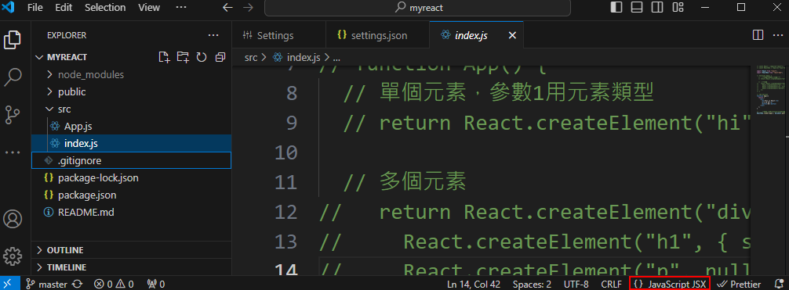
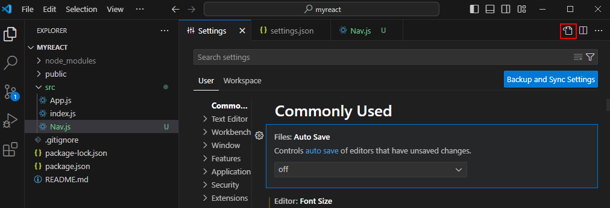
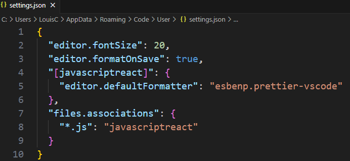
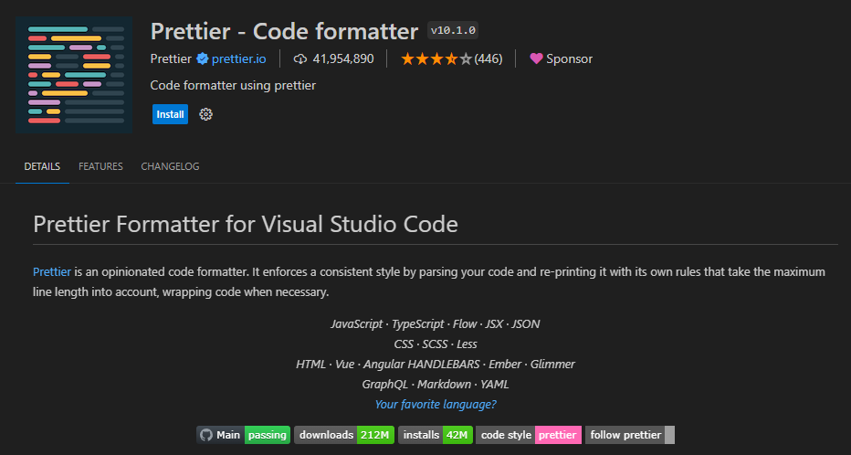
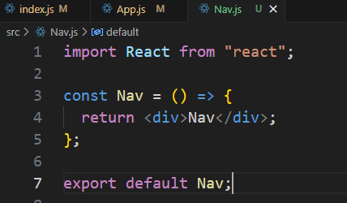
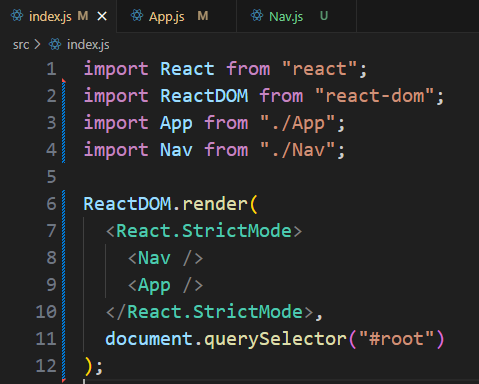
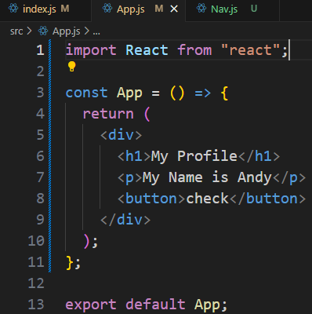
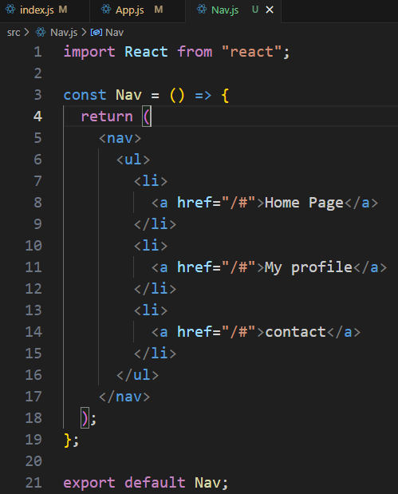
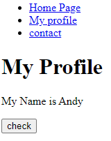

## 創建 React 專案

專案名稱要全小寫

    npx create-react-app "專案名稱"

## 啟動專案

    npm start

## 資料夾結構

### Public

放HTML檔，每個HTML檔會對應[src]資料夾裡面的相同檔名的js檔,無須在Html黨內宣告這個相同檔名的js檔路徑

### src

js檔案

### .gitignore

預設就有/node_modules跟一些.env

## 基本內容

### 匯入元件

    import React from "react";
    import ReactDom from "react-dom";

### 顯示網頁內容

使用以下語法產生單個內容

    function App() {
    return React.createElement("hi", null, "This is React App");}

使用以下語法產生多個內容

    Function App() {
        return React.createElement("div", null, [
        React.createElement("h1", { style: { color: "red" } }, "This is"),
        React.createElement("p", null, "I am bb"),
        React.createElement("button", null, "OK"),
        ]);
    }

產生內容在HTML中id="root"的元素中

    ReactDom.render(App(), document.querySelector("#root"));

## JSX and Babel

JSX: 讓js寫起來像HTML

Babel: 編譯JSX

寫法如下，注意Function名稱開頭一定要大寫，多個元素一定要用div包起來

    function App(){
        return (
            

                <h1>This is React</h1>
                
I am bb

                <button>OK</button>
            

        );
    }

### VS Code 編輯 JSX

<h3>語法檢查工具從js改成React</h3>

單一修改 : 焦點在js檔編輯程式碼時，將VSCODE狀態列的右邊-javascript點擊改成JSX

全部js都視為React : 在VS Code的setting畫面，點擊右上角的OPEN Setting(JSON)

內容加上

    "[javascriptreact]": {
        "editor.defaultFormatter": "esbenp.prettier-vscode"
    },
    "files.associations":{
        "*.js":"javascriptreact"
    }

若找不到esbenp.prettier-vscode表示沒有下載插件-Prettier - Code formatter

安裝插件 - ES7+ React/Redux/React-Native snippets

安裝後，在js檔案輸入rafce就會自動長出如下語法，快速建置基本語法

### Page 範例

